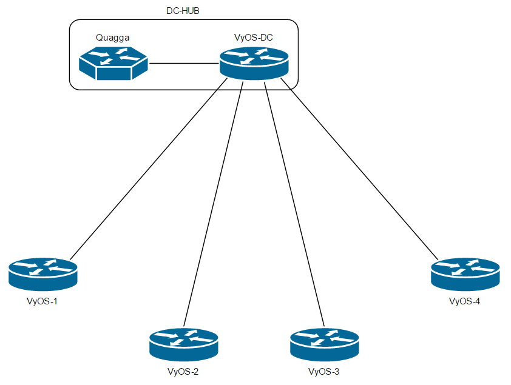
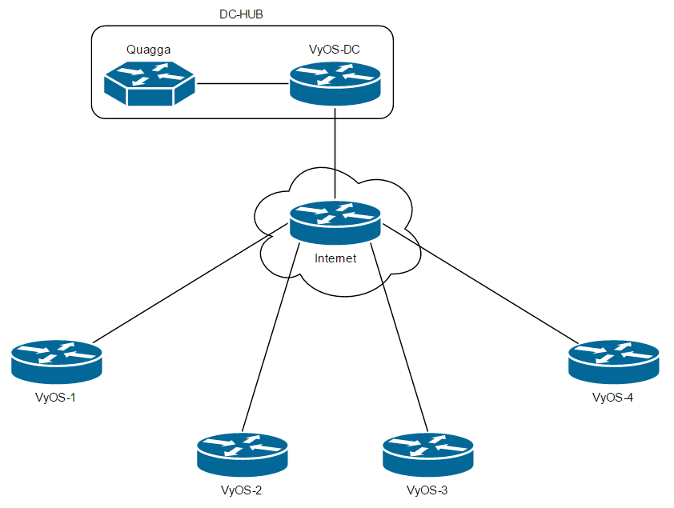
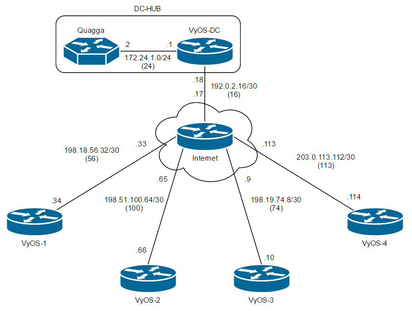
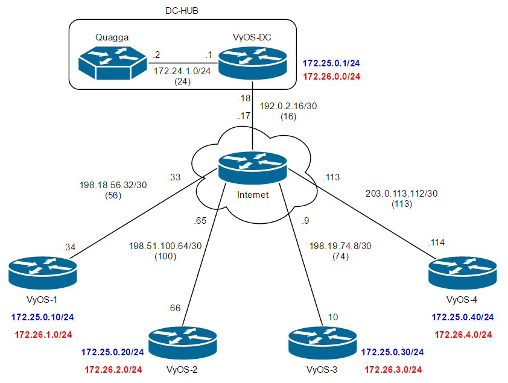

# Open Source DMVPN Implementation Lab

How to implement a dynamic multi-point VPN (DMVPN) without using any Cisco equipment. Cisco DMVPN is a great way to implement multi-point VPNs without having to reconfigure the hub each time you want to add a spoke. It's also a great way to deal with spokes having dynamic public IPs. It allows for the dynamic creation of inter-spoke tunnels, reducing the need to hairpin traffic at the hub.

For this lab, we will do a simple DMVPN+BGP configuration using VyOS routers as spokes and at the hub, a VyOS router for the DMVPN and an Ubuntu Server running a special version of Quagga, Cumulus RoH, for the BGP routing. It might work with the default flavor of Quagga, but the interactive shell of Cumulus RoH is nice and it is not sure that the standard Quagga has an implementation of "bgp listen range".

VyOS version 1.2.0-beta1 will be used for this lab because the latest builds have issues with IPsec. For the Quagga machine, it will be an Ubuntu server 16.04 with Cumulus RoH installed. Here's the link for [Cumulus RoH](https://cumulusnetworks.com/products/cumulus-routing-on-the-host/). With VyOS, Ubuntu and Cumulus being free, we can do this DMVPN setup without any licensing requirements.

Below is the topology that will be used during this lab.



It has a hub site called DC-HUB that includes the VyOS-DC and the Quagga router. It also has 4 spokes, each running a VyOS-# router. It will be using a simple IPsec profile for the DMVPN and it will be using iBGP with private AS number 65000 for the BGP. In order to simulate an Internet connection, we will use a 6th VyOS router that will be located between the VyOS-DC and the 4 VyOS spokes and will allow for connectivity between them.



This is the lab topology with the Internet being emulated by a single router.



IP addresses and VLANs for all "physical" connections.


In blue, the DMVPN tunnel IP addresses.



In red, the prefixes advertised via BGP.

For this lab, a single interface per router will be used and all the connectivity will be done via VLANs and sub-interfaces. In the 4th image, the DMVPN tunnel IPs was added. In the 5th one, the prefixes the spokes routers will be advertising via BGP to the hub was added.

Let's get the 6 VyOS instances and the Ubuntu VM set up. Once all the addressing is done, add a default route to each VyOS pointing towards the "Internet" router. The Ubuntu VM should have its gateway set to the VyOS-DC IP.

This is what the `show interfaces` command returns on VyOS-Internet :

```
vyos@vyos-internet:~$ show int
Codes: S - State, L - Link, u - Up, D - Down, A - Admin Down
Interface        IP Address                        S/L  Description
---------        ----------                        ---  -----------
eth0             -                                 u/u
eth0.16          192.0.2.17/30                     u/u  VyOS-DC
eth0.56          198.18.56.33/30                   u/u  VyOS-1
eth0.74          198.19.74.9/30                    u/u  VyOS-3
eth0.100         198.51.100.65/30                  u/u  VyOS-2
eth0.113         203.0.113.113/30                  u/u  VyOS-4

```

We can see that all of the connections and the routers are pingable from each other. Now that the  basic connectivity is established, it's time to start setting up the DMVPN configuration. Let's start by the hub. Here's the full configuration, for ease of cut-and-paste to your own hub, we'll go through in details after :

```
set interfaces tunnel tun0 address 172.25.0.1/24
set interfaces tunnel tun0 encapsulation gre
set interfaces tunnel tun0 local-ip 192.0.2.18
set interfaces tunnel tun0 multicast enable
set interfaces tunnel tun0 parameters ip key 1

set protocols nhrp tunnel tun0 cisco-authentication PASSWORD
set protocols nhrp tunnel tun0 holding-time  300
set protocols nhrp tunnel tun0 multicast dynamic
set protocols nhrp tunnel tun0 redirect

set vpn ipsec esp-group ESP-Lab compression disable 
set vpn ipsec esp-group ESP-Lab lifetime 7200 
set vpn ipsec esp-group ESP-Lab mode tunnel 
set vpn ipsec esp-group ESP-Lab pfs dh-group16 
set vpn ipsec esp-group ESP-Lab proposal 1 encryption aes256 
set vpn ipsec esp-group ESP-Lab proposal 1 hash sha256 

set vpn ipsec ike-group IKE-Lab dead-peer-detection action clear
set vpn ipsec ike-group IKE-Lab dead-peer-detection interval 30
set vpn ipsec ike-group IKE-Lab dead-peer-detection timeout 90
set vpn ipsec ike-group IKE-Lab ikev2-reauth no
set vpn ipsec ike-group IKE-Lab key-exchange ikev1
set vpn ipsec ike-group IKE-Lab lifetime 86400
set vpn ipsec ike-group IKE-Lab proposal 1 dh-group 16
set vpn ipsec ike-group IKE-Lab proposal 1 encryption aes256
set vpn ipsec ike-group IKE-Lab proposal 1 hash sha256

set vpn ipsec ipsec-interfaces interface eth0.16

set vpn ipsec profile NHRPVPN
set vpn ipsec profile NHRPVPN authentication mode pre-shared-secret
set vpn ipsec profile NHRPVPN authentication pre-shared-secret PASSWORD
set vpn ipsec profile NHRPVPN bind tunnel tun0 
set vpn ipsec profile NHRPVPN esp-group ESP-Lab
set vpn ipsec profile NHRPVPN ike-group IKE-Lab

```

Let's go through all the sections one by one :

```
set interfaces tunnel tun0 address 172.25.0.1/24
set interfaces tunnel tun0 encapsulation gre
set interfaces tunnel tun0 local-ip 192.0.2.18
set interfaces tunnel tun0 multicast enable
set interfaces tunnel tun0 parameters ip key 1

```

This section configures the DMVPN tunnel interface on the hub. We set the tunnel address and the public IP associated with that tunnel. By omitting the `remote-ip` parameters, we are setting this tunnel as a Multipoint GRE (mGRE). The `parameters ip key 1` is used to add a tiny amount of security, both sides will need to have the same key for the setup to work. It's more a security against typos if we have multiple hubs rather than proper security.

```
set protocols nhrp tunnel tun0 cisco-authentication PASSWORD
set protocols nhrp tunnel tun0 holding-time  300
set protocols nhrp tunnel tun0 multicast dynamic
set protocols nhrp tunnel tun0 redirect

```

Here's where the real DMVPN config starts. NHRP, the Next Hop Resolution Protocol is what makes DMVPN works dynamically and allows it to configure dynamic spoke to spoke tunnels. Here we also set the password that is going to be used for the DMVPN spokes.

```
set vpn ipsec esp-group [...]
set vpn ipsec ike-group [...]

```

These two sections are where we set the parameters for the IPsec encryption profile of the DMVPN tunnels. We are using a good encryption level with AES-256 and SHA-256. This should ensure the tunnels are properly encrypted and safe from eavesdropping.

```
set vpn ipsec ipsec-interfaces interface eth0.16

```

Here we set which interface should be used by the IPsec tunnels. This correspond to the "public" interface, the one facing the Internet.

```
set vpn ipsec profile NHRPVPN
set vpn ipsec profile NHRPVPN authentication mode pre-shared-secret
set vpn ipsec profile NHRPVPN authentication pre-shared-secret PASSWORD
set vpn ipsec profile NHRPVPN bind tunnel tun0 
set vpn ipsec profile NHRPVPN esp-group ESP-Lab
set vpn ipsec profile NHRPVPN ike-group IKE-Lab

```

Here is where we set the parameters for the DMVPN tunnels. This profile uses the esp-group and ike-group configured earlier, and applies it to the IPsec tunnels it will create. It also binds the mGRE tunnel we created earlier. This is where all the configured parameters come together to make the whole thing work. With that done, we have our DMVPN configuration ready on the hub.

The spokes configuration is slightly different. Once again, here it is in full before we go into the details :

```
set interfaces tunnel tun0 address 172.25.0.10/24
set interfaces tunnel tun0 encapsulation gre
set interfaces tunnel tun0 local-ip 0.0.0.0
set interfaces tunnel tun0 multicast enable
set interfaces tunnel tun0 parameters ip key 1

set protocols nhrp tunnel tun0 cisco-authentication PASSWORD
set protocols nhrp tunnel tun0 map 172.25.0.1/24 nbma-address 192.0.2.18
set protocols nhrp tunnel tun0 map 172.25.0.1/24 register
set protocols nhrp tunnel tun0 multicast nhs
set protocols nhrp tunnel tun0 redirect
set protocols nhrp tunnel tun0 shortcut

set vpn ipsec esp-group ESP-Lab compression disable 
set vpn ipsec esp-group ESP-Lab lifetime 7200 
set vpn ipsec esp-group ESP-Lab mode tunnel 
set vpn ipsec esp-group ESP-Lab pfs dh-group16 
set vpn ipsec esp-group ESP-Lab proposal 1 encryption aes256 
set vpn ipsec esp-group ESP-Lab proposal 1 hash sha256 

set vpn ipsec ike-group IKE-Lab dead-peer-detection action clear
set vpn ipsec ike-group IKE-Lab dead-peer-detection interval 30
set vpn ipsec ike-group IKE-Lab dead-peer-detection timeout 90
set vpn ipsec ike-group IKE-Lab ikev2-reauth no
set vpn ipsec ike-group IKE-Lab key-exchange ikev1
set vpn ipsec ike-group IKE-Lab lifetime 86400
set vpn ipsec ike-group IKE-Lab proposal 1 dh-group 16
set vpn ipsec ike-group IKE-Lab proposal 1 encryption aes256
set vpn ipsec ike-group IKE-Lab proposal 1 hash sha256

set vpn ipsec ipsec-interfaces interface eth0.56

set vpn ipsec profile NHRPVPN
set vpn ipsec profile NHRPVPN authentication mode pre-shared-secret
set vpn ipsec profile NHRPVPN authentication pre-shared-secret PASSWORD
set vpn ipsec profile NHRPVPN bind tunnel tun0 
set vpn ipsec profile NHRPVPN esp-group ESP-Lab
set vpn ipsec profile NHRPVPN ike-group IKE-Lab

```

As we can see, the configuration here is nearly identical to the one used on the hub. Let's have a look at the sections in more detail :

```
set interfaces tunnel tun0 address 172.25.0.2/24
set interfaces tunnel tun0 encapsulation gre
set interfaces tunnel tun0 local-ip 0.0.0.0
set interfaces tunnel tun0 multicast enable
set interfaces tunnel tun0 parameters ip key 1

```

Here we have the tunnel config. An important thing to note is the use of `local-ip 0.0.0.0` which allows for any IP to be used. With this, we can have a DHCP address on our WAN connection and it won't affect the config. The only site that needs a static IP is the hub.

```
set protocols nhrp tunnel tun0 cisco-authentication PASSWORD
set protocols nhrp tunnel tun0 map 172.25.0.1/24 nbma-address 192.0.2.18
set protocols nhrp tunnel tun0 map 172.25.0.1/24 register
set protocols nhrp tunnel tun0 multicast nhs
set protocols nhrp tunnel tun0 redirect
set protocols nhrp tunnel tun0 shortcut

```

The NHRP configuration has two important lines in it: the `map` statements. The first one maps the tunnel IP of the hub to its public IP. The second one ensures that we register our own address to the hub for NHRP to work for other sites. The rest of the configuration is completely identical to the hub, except it specifies the proper WAN interface.

Once the hub and all the spokes configured using these templates, we will see the tunnels are all up. To verify this, we can use the `show vpn ipsec sa` command on the hub. The result should be similar to this :

```
vyos@vyos-dc:~$ sh vpn ipsec sa
Peer ID / IP                            Local ID / IP
------------                            -------------
0.0.0.0                                 192.0.2.18

    Tunnel  State  Bytes Out/In   Encrypt  Hash  NAT-T  A-Time  L-Time  Proto
    ------  -----  -------------  -------  ----  -----  ------  ------  -----
    tun0    down   n/a            n/a      n/a   no     0       7200    gre


Peer ID / IP                            Local ID / IP
------------                            -------------
198.19.74.10                            192.0.2.18

    Tunnel  State  Bytes Out/In   Encrypt  Hash  NAT-T  A-Time  L-Time  Proto
    ------  -----  -------------  -------  ----  -----  ------  ------  -----
    tun0[3] up     232.0/192.0    aes256   256   no     4285    7200    gre


Peer ID / IP                            Local ID / IP
------------                            -------------
203.0.113.114                           192.0.2.18

    Tunnel  State  Bytes Out/In   Encrypt  Hash  NAT-T  A-Time  L-Time  Proto
    ------  -----  -------------  -------  ----  -----  ------  ------  -----
    tun0[4] up     232.0/192.0    aes256   256   no     3882    7200    gre


Peer ID / IP                            Local ID / IP
------------                            -------------
198.51.100.66                           192.0.2.18

    Tunnel  State  Bytes Out/In   Encrypt  Hash  NAT-T  A-Time  L-Time  Proto
    ------  -----  -------------  -------  ----  -----  ------  ------  -----
    tun0[2] up     232.0/192.0    aes256   256   no     4377    7200    gre


Peer ID / IP                            Local ID / IP
------------                            -------------
198.18.56.34                            192.0.2.18

    Tunnel  State  Bytes Out/In   Encrypt  Hash  NAT-T  A-Time  L-Time  Proto
    ------  -----  -------------  -------  ----  -----  ------  ------  -----
    tun0[1] up     232.0/192.0    aes256   256   no     4535    7200    gre

```

As we can see, we have our mGRE tunnel configured. This tunnel will always show "down", but it will generate a "subtunnel" for each of the DMVPN spokes. If we ping from a tunnel IP to another, we will see the traffic counters go up in the corresponding tunnels. On the spokes, the same `show vpn ipsec sa` command will return :

```
vyos@vyos-1:~$ sh vpn ipsec sa
Peer ID / IP                            Local ID / IP
------------                            -------------
192.0.2.18                              198.18.56.34

    Tunnel  State  Bytes Out/In   Encrypt  Hash  NAT-T  A-Time  L-Time  Proto
    ------  -----  -------------  -------  ----  -----  ------  ------  -----
            up     192.0/232.0    aes256   256   no     2037    3600    gre

```

This shows the tunnel created towards the hub. Now let's try to ping one of the other spokes, from VyOS-1 to VyOS-2. We see the replies coming in. If we look again the the VPN tunnels, we won't see a direct connection between both spokes. This correspond to a "DMVPN Phase 1" type of setup. Traffic is still able to be routed from a spoke to the other, but it is hairpinned via the hub. We will explore this limitation later. For now, let's get the BGP routing set up.

The BGP will be configured with the Quagga router using the `bgp listen range` command to allow for dynamic peering with any number of spokes. Then the hub will be configured as a route reflector client peer on Quagga, allowing the hub to receive all the prefixes advertised by the spokes. With this initial setup, all the spokes will see the hub's advertisement but not the other spokes advertisement.

The BGP configuration on Quagga is quite simple :

```
router bgp 65000
 neighbor SPOKES peer-group
 neighbor SPOKES remote-as 65000
 neighbor 172.24.1.1 remote-as 65000
 bgp listen range 172.25.0.0/24 peer-group SPOKES
 !
 address-family ipv4 unicast
  neighbor SPOKES activate
  neighbor 172.24.1.1 activate
  neighbor 172.24.1.1 route-reflector-client
 exit-address-family
!
ip route 172.25.0.0/24 172.24.1.1

```

This configures a peer-group named SPOKES, with remote-as 65000. It also configures a listen range corresponding to the subnet we use over the DMVPN tunnel. This allows any spoke to connect to the Quagga router and form a BGP session dynamically. Then we configure the VyOS-DC hub as a neighbor, adding to it the `route-reflector-client` parameter that ensures that all routes learned by Quagga will be sent to the hub. Without this, the default behavior of iBGP is to assume that every iBGP peer is meshed and not to repeat routes learned via iBGP to another iBGP peer. Finally, the static route that points the tunnel subnet to the hub is there so the BGP recursion works properly. If we omit this route, all our learned routes will show as invalid.

Once the Quagga router is configured, we can configure the hub :

```
set protocol bgp 65000 neighbor 172.24.1.2 remote-as 65000
set protocol bgp 65000 network 172.26.0.0/24

```

With this configuration, the hub will peer with Quagga and it will advertise the 172.26.0.0/24 prefix via BGP. For the spokes, the configuration is very similar, with an added route that tells them where to find the Quagga router to kickstart the process.

```
set protocol static route 172.24.1.0/24 next-hop 172.25.0.1
set protocol bgp 65000 neighbor 172.24.1.2 remote-as 65000
set protocol bgp 65000 neighbor 172.24.1.2 update 172.25.0.10
set protocol bgp 65000 network 172.26.1.0/24

```

This configuration sets the static route towards Quagga and specifies the IP address that will source the BGP peering as being the tunnel IP. It also specifies the prefix that will be advertised by the spoke. Once we have done all the BGP configuration on all 4 spokes, we can verify on Quagga to see if we get all the prefixes. The routes will be showing up in duplicate due to the recursion which is normal :

```
quagga# show ip route
Codes: K - kernel route, C - connected, S - static, R - RIP,
       O - OSPF, I - IS-IS, B - BGP, T - Table,
       > - selected route, * - FIB route

K>* 0.0.0.0/0 via 172.24.1.1, ens160
C>* 10.200.200.2/32 is directly connected, lo
C>* 172.24.1.0/24 is directly connected, ens160
S>* 172.25.0.0/24 [1/0] via 172.24.1.1, ens160
B>* 172.26.0.0/24 [200/1] via 172.24.1.1, ens160, 00:22:16
B>  172.26.1.0/24 [200/1] via 172.25.0.10 (recursive), 00:16:51
  *                         via 172.24.1.1, ens160, 00:16:51
B>  172.26.2.0/24 [200/1] via 172.25.0.20 (recursive), 00:16:00
  *                         via 172.24.1.1, ens160, 00:16:00
B>  172.26.3.0/24 [200/1] via 172.25.0.30 (recursive), 00:14:24
  *                         via 172.24.1.1, ens160, 00:14:24
B>  172.26.4.0/24 [200/1] via 172.25.0.40 (recursive), 00:13:42
  *                         via 172.24.1.1, ens160, 00:13:42

```

This shows that all the routes have been learned properly in Quagga. We should be able to see them as well in the VyOS-DC hub since it is a route reflector client :

```
vyos@vyos-dc:~$ show ip route
Codes: K - kernel route, C - connected, S - static, R - RIP, O - OSPF,
       I - ISIS, B - BGP, > - selected route, * - FIB route

S>* 0.0.0.0/0 [1/0] via 192.0.2.17, eth0.16
C>* 127.0.0.0/8 is directly connected, lo
C>* 172.24.1.0/24 is directly connected, eth0.24
C>* 172.25.0.0/24 is directly connected, tun0
C>* 172.26.0.0/24 is directly connected, eth0.260
B>* 172.26.1.0/24 [200/1] via 172.25.0.10, tun0, 00:18:16
B>* 172.26.2.0/24 [200/1] via 172.25.0.20, tun0, 00:17:26
B>* 172.26.3.0/24 [200/1] via 172.25.0.30, tun0, 00:15:50
B>* 172.26.4.0/24 [200/1] via 172.25.0.40, tun0, 00:15:07
C>* 192.0.2.16/30 is directly connected, eth0.16

```

Yes, we can see all the prefixes advertised by all the hosts. Let's check on VyOS-1 and see if we can see the routes :

```
vyos@vyos-1:~$ show ip route
Codes: K - kernel route, C - connected, S - static, R - RIP, O - OSPF,
       I - ISIS, B - BGP, > - selected route, * - FIB route

S>* 0.0.0.0/0 [1/0] via 198.18.56.33, eth0.56
C>* 127.0.0.0/8 is directly connected, lo
S>* 172.24.1.0/24 [1/0] via 172.25.0.1, tun0
C>* 172.25.0.0/24 is directly connected, tun0
B>* 172.26.0.0/24 [200/1] via 172.24.1.1 (recursive via 172.25.0.1), 00:20:06
C>* 172.26.1.0/24 is directly connected, eth0.261
C>* 198.18.56.32/30 is directly connected, eth0.56

```

We can see that VyOS-1 only learned the route advertised by the hub due to the iBGP behavior of not re-advertising prefixes learned via iBGP. If you don't want the spokes to see each others, you can leave it like that. If you want the spokes to see each others' prefixes, then we simply have to add a single line to Quagga :

```
quagga# conf t
quagga(config)# router bgp 65000
quagga(config-router)# neighbor SPOKES route-reflector-client

```

Let's check on VyOS-1 once again, see if anything is different :

```
vyos@vyos-1:~$ show ip route
Codes: K - kernel route, C - connected, S - static, R - RIP, O - OSPF,
       I - ISIS, B - BGP, > - selected route, * - FIB route

S>* 0.0.0.0/0 [1/0] via 198.18.56.33, eth0.56
C>* 127.0.0.0/8 is directly connected, lo
S>* 172.24.1.0/24 [1/0] via 172.25.0.1, tun0
C>* 172.25.0.0/24 is directly connected, tun0
B>* 172.26.0.0/24 [200/1] via 172.24.1.1 (recursive via 172.25.0.1), 00:00:26
C>* 172.26.1.0/24 is directly connected, eth0.261
B>* 172.26.2.0/24 [200/1] via 172.25.0.20, tun0, 00:00:26
B>* 172.26.3.0/24 [200/1] via 172.25.0.30, tun0, 00:00:26
B>* 172.26.4.0/24 [200/1] via 172.25.0.40, tun0, 00:00:26
C>* 198.18.56.32/30 is directly connected, eth0.56

```

Now we see all routes from all peers. We can ping the interfaces and we'll see the replies come in. We have created a full DMVPN+BGP setup that advertises the spokes prefixes dynamically. With this configuration, we don't have to touch anything on the hub to add a spoke to our VPN. This is a great way to reduce the risk associated with config changes on the hub site routers.

The downside of this configuration is that we only achieved a "Phase 1" DMVPN, so traffic is hair-pinned at the hub. The conversion to Phase 2 or Phase 3 DMVPN will be the subject of another lab.

## Source

https://www.reddit.com/r/networking/comments/5wz538/noncisco_dmvpn_implementation_lab/